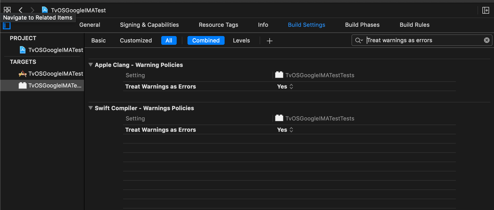

# TvOSGoogleIMATest
This Repository accompanies the issues described in:
https://groups.google.com/forum/#!topic/ima-sdk/_vcxMuYiIQA

## How to run
Go to the root of the repo and run

- `bundle install` (if fails please install bundler `gem install bundler`)
- `bundle exec fastlane test`

This will run Unit Tests as we run them on our CI. Please be aware that we are dealing "warnings as errors" in our project settings. This results in the failure of the command due to having a mismatch as described in the post.

`❌ /pathToRepo/TvOSGoogleIMATest/Pods/GoogleAds-IMA-tvOS-SDK/GoogleInteractiveMediaAds.framework/Headers/IMACompanionAd.h:22:1: conflicting nullability specifier on return types, 'nullable' conflicts with existing specifier 'nonnull'`

